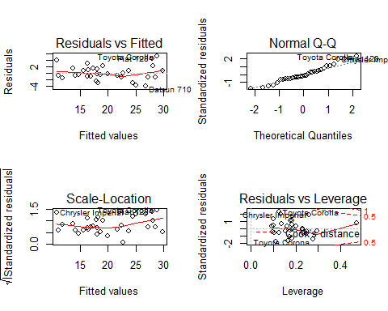
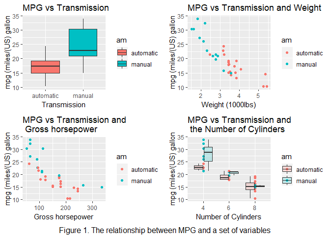

Summary
-------

The report explored the relationship between transmission types and
miles per gallon (MPG). Figure 1 in appendix showed that an automatic
transmission trend to be better for MPG. Then, we performed t-test to
verify the hypothesis and draw a conclusion. To quantify the MPG
difference between automatic and manual transmissins, we fit the MPG
(outcome) and transmission (regressor) in to the linar model.

Results
-------

The mean mpg of automatic transmission is 24.3923077 miles per gallon,
the mean of manual transmission is 17.1473684 miles per gallon. An
automatic transmission is better for MPG. MPG can fiited into linear
regression with the regressor of transmission.

**Model Selection**

We set **mpg** as the outcome and **transmission(am)** as the repressor.
We selected linear regression model,
*Y**i* = *β*0 + *β*1*X*1 + *ϵ**i*,
*X*1 is either 0 for automatic or 1 for manual.

**Interpretion**

The intercept *β*0 is 24.3923077, which is interpret as the
expected mpg of automatic transmission and is euqal to the mean mpg of
automatic transmission.  
The slope *β*1 is -7.2449393, which is interpreted as the
expected change of the mean mpg comparing those in manual to those in
automatic transmission. *β*0 + *β*1 is equal to
the mean mpg of manual transmission.

**T-test**

We did student t-test with the *H*0: The difference in means
in automatic and manual transmission is equal, and the *H*0 :
The mean in automatic is greater than that in manual transmission. The
p-value is 1.425103710^{-4}. If we assumed the type I error *α* = 0.05,
then we rejected *H*0 and concluded that an automatic
transmission is better for MPG.

**Diagnostics**

    ## [1] 3.434752e-16

The mean of residuals is 3.434752510^{-16}, approximating to zero.  
The patten in plot "Residual vs Fitted" is approximately flat,
indicating the homoscedasticity of residuals or equal variance.

**The uncertainty**

We assumed other variables not included in the linear model were
completely randomized. The error *ϵ* in the linear model followed normal
distribution.

Appendix
--------

    ## 'data.frame':    32 obs. of  11 variables:
    ##  $ mpg : num  21 21 22.8 21.4 18.7 18.1 14.3 24.4 22.8 19.2 ...
    ##  $ cyl : num  6 6 4 6 8 6 8 4 4 6 ...
    ##  $ disp: num  160 160 108 258 360 ...
    ##  $ hp  : num  110 110 93 110 175 105 245 62 95 123 ...
    ##  $ drat: num  3.9 3.9 3.85 3.08 3.15 2.76 3.21 3.69 3.92 3.92 ...
    ##  $ wt  : num  2.62 2.88 2.32 3.21 3.44 ...
    ##  $ qsec: num  16.5 17 18.6 19.4 17 ...
    ##  $ vs  : num  0 0 1 1 0 1 0 1 1 1 ...
    ##  $ am  : num  1 1 1 0 0 0 0 0 0 0 ...
    ##  $ gear: num  4 4 4 3 3 3 3 4 4 4 ...
    ##  $ carb: num  4 4 1 1 2 1 4 2 2 4 ...

    ## 
    ## Call:
    ## lm(formula = mpg ~ factor(am), data = mtcars1)
    ## 
    ## Residuals:
    ##     Min      1Q  Median      3Q     Max 
    ## -9.3923 -3.0923 -0.2974  3.2439  9.5077 
    ## 
    ## Coefficients:
    ##                  Estimate Std. Error t value Pr(>|t|)    
    ## (Intercept)        24.392      1.360  17.941  < 2e-16 ***
    ## factor(am)manual   -7.245      1.764  -4.106 0.000285 ***
    ## ---
    ## Signif. codes:  0 '***' 0.001 '**' 0.01 '*' 0.05 '.' 0.1 ' ' 1
    ## 
    ## Residual standard error: 4.902 on 30 degrees of freedom
    ## Multiple R-squared:  0.3598, Adjusted R-squared:  0.3385 
    ## F-statistic: 16.86 on 1 and 30 DF,  p-value: 0.000285

    ## 
    ##  Welch Two Sample t-test
    ## 
    ## data:  mpg by factor(am)
    ## t = 3.7671, df = 18.332, p-value = 0.0006868
    ## alternative hypothesis: true difference in means is greater than 0
    ## 95 percent confidence interval:
    ##  3.913256      Inf
    ## sample estimates:
    ## mean in group automatic    mean in group manual 
    ##                24.39231                17.14737
